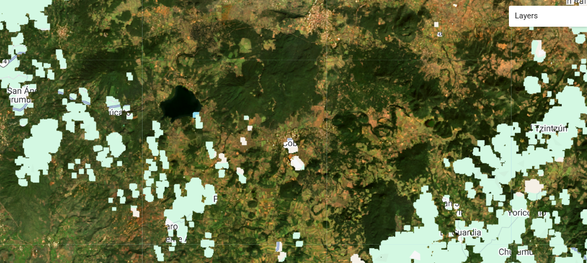
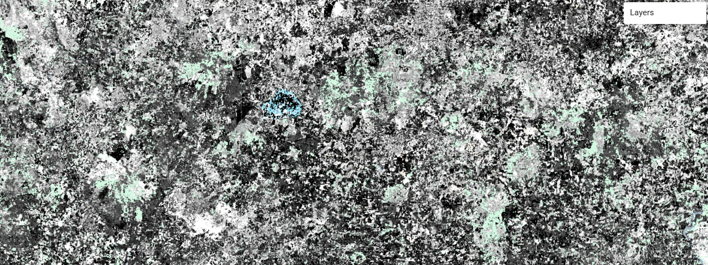
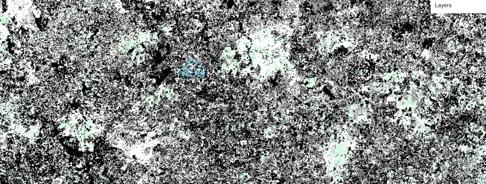

# Introduction

geeBFASTmonitor is a reimplementation of R bfastmonitor with only some slight variations.

# BFASTmonitor

BFASTmonitor is a variation of bfast for monitoring purposes. Since geeBFASTmonitor is mostly a reimplementation, the [original documentation](https://www.rdocumentation.org/packages/bfast/versions/1.5.7/topics/bfastmonitor) is still relevant.

# Running geeBFASTmonitor

It's as easy as including the following code in the beginning of your script :

    var engine = require('users/andreim/geeMonitor:monitor.js');

in your gee script. Afterwards, you'll have access to the function ```engine.bfastMonitor(roi,historyStart,historyEnd,monitoringStart,monitoringEnd,h,period,alpha,magnitudeThreshold,harmonics)```

The parameters are similar to the R version of bfastMonitor:

 - roi: region of interest as a Feature
 - historyStart: The starting date of the stable period.
 - historyEnd: The end date of the stable period.
 - monitoringStart: The starting date of the monitoring period.
 - monitoringEnd: The end date of the monitoring period.
 - h: numeric scalar from interval (0,1) specifying the bandwidth relative to the sample size in MOSUM/ME monitoring processes
 - period: maximum time, relative to the history period, that should be monitored. The default is 10 times the history period.
 - alpha: Significance level of the monitoring (and ROC, if selected) procedure, i.e., probability of type I error.
 - magnitudeThreshold: Threshold for magnitude level for which a change should be considered. Default is 0.
 - harmonics: Order of the harmonic term.

A typical way of using the function is to save its result:

```var result = engine.bfastMonitor(roi,historyStart,historyEnd,monitoringStart,monitoringEnd,h,period,alpha,magnitudeThreshold,harmonics)```

The most important results are:
 - the time of change found in bfastResults.timeCnk2
 - magnitude of change found in bfastResults.Cnk

# Applications

If you want to play with the algorithm interactively, please check:

https://andreim.users.earthengine.app/view/bfastmonitor 

# Update 2025

1. Original ```engine.bfastMonitor``` function was updated to use Level 2 Collection 2 Tier 1 surface reflectance collections and include landsat 9.
2. A custom function was added to the repo ```engine.bfastMonitorCustom``` for running bfast with a custom image collection (e.g., Sentinel-2) with some minor corrections.

# Working Examples

## Traditional bfast (with landsat)

Copy complete code in "monitor" file from repo and paste it in any repo, save it as geeMonitor. Then, change the location of the script so it matches the location.

```js
// Read bfast script
var engine = require('users/user/repo:geeMonitor');
```

Define the region of interest and parameters for analysis.

```js
var geometry = ee.Geometry.Polygon(
        [[[-101.79775992358168, 19.463438965605146],
          [-101.79775992358168, 19.352046838562533],
          [-101.65219107592543, 19.352046838562533],
          [-101.65219107592543, 19.463438965605146]]], null, false)

// Polygon of interest
var polygon = geometry, 
    // Start for history period
    historyStart = '2015-01-01', 
    // End for history period
    historyEnd = '2018-01-01',
    // Start for monitoring period
    monitoringStart = '2018-01-01',
    // End for monitoring period
    monitoringEnd = '2024-01-01',
    // Pixel size of images
    scale = 30,
    // Bfast parameters
    h = 0.25,
    period = 10,
    alpha = 0.05,
    magnitudeThreshold = 0.2,
    harmonics = 3;
```

Calculate centroid of polygon to try to avoid error in areas with multipass info, i.e., several path/rows in Landsat or several tiles in Sentinel-2. If the "Arguments must have same length along one axis" occurr try moving the roi.

```js
// Get centroid of area of interest to consult images
// and avoid the "Arguments must have same length along one axis" error
var roi = polygon.centroid(10); 

Map.centerObject(roi, 11);
Map.addLayer(roi, {}, 'roi');
```

Perform bfast analysis

```js

var result = engine.bfastMonitor(roi,
  historyStart,historyEnd,monitoringStart,monitoringEnd,h,
  period,alpha,magnitudeThreshold,harmonics);
```

Get bfast main results: magnitude of break and time of break.

```js
var expIm = ee.ImageCollection(ee.Dictionary(result).get('bfastResults'));

var breakMag = ee.Image(expIm.filter(ee.Filter.eq('bfast:result', 'breakMagnitude')).first());
var breakTime = ee.Image(expIm.filter(ee.Filter.eq('bfast:result', 'breakTime')).first());

Map.addLayer(breakMag, {min:-0.2, max:0.2}, 'breakMagnitude');
Map.addLayer(breakTime, {min:2019, max:2021}, 'breakTime');
```

Export images. Change EPSG code so that it matches the region of interest.

```js
Export.image.toDrive({
  folder: 'BFAST',
  description: 'breakMag',
  image: breakMag,
  scale: scale,
  region: polygon,
  crs: 'EPSG:32614',
  maxPixels: 1e12
});

Export.image.toDrive({
  folder: 'BFAST',
  description: 'breakTime',
  image: breakTime,
  scale: scale,
  region: polygon,
  crs: 'EPSG:32614',
  maxPixels: 1e12
});
```

## Custom bfast (with another image collection)

Copy complete code in "monitor" file from repo and paste it in any repo, save it as geeMonitor. Then, change the location of the script so it matches the location.

```js
// Read bfast script
var engine = require('users/user/repo:geeMonitor');
```

Define the region of interest and parameters for analysis. Now let's use the Harmonized Landsat Sentinel-2 (HLS) collection

```js
var  hls = ee.ImageCollection("NASA/HLS/HLSS30/v002");

var geometry = ee.Geometry.Polygon(
        [[[-101.79775992358168, 19.463438965605146],
          [-101.79775992358168, 19.352046838562533],
          [-101.65219107592543, 19.352046838562533],
          [-101.65219107592543, 19.463438965605146]]], null, false)

// Polygon of interest
var polygon = geometry, 
    // Start for history period
    historyStart = '2015-01-01', 
    // End for history period
    historyEnd = '2018-01-01',
    // Start for monitoring period
    monitoringStart = '2018-01-01',
    // End for monitoring period
    monitoringEnd = '2024-01-01',
    // Pixel size of images
    scale = 30,
    // Bfast parameters
    h = 0.25,
    period = 10,
    alpha = 0.05,
    magnitudeThreshold = 0.2,
    harmonics = 3;
```

Calculate centroid of polygon to try to avoid error in areas with multipass info, i.e., several path/rows in Landsat or several tiles in Sentinel-2. If the "Arguments must have same length along one axis" occurr try moving the roi. Several attempts have been made to fix this issue without success.

```js
// Get centroid of area of interest to consult images
// and avoid the "Arguments must have same length along one axis" error
var roi = polygon.centroid(10); 

Map.centerObject(roi, 11);
Map.addLayer(roi, {}, 'roi');
```

Preprocess image collection, i.e., mask clouds, select bands of interest and calculate index of interest (NDMI).

```js
var col = hls.filterDate(historyStart, monitoringEnd)
             //.filter(ee.Filter.calendarRange(5,10,'month'))
             .filterBounds(roi)
             .map(function(image){
               var qa = image.select('Fmask');
    
                var cirrus = 1 << 0;
                var cloud = 1 << 1;
                var dilCloud = 1 << 2;
                var cloudShadow = 1 << 3;
              
                // bitwiseAnd allows you to do operations based on bit values
                var clearMask = qa.bitwiseAnd(cirrus).eq(0)
                .and(qa.bitwiseAnd(cloud).eq(0))
                                  .and(qa.bitwiseAnd(dilCloud).eq(0))
                                  .and(qa.bitwiseAnd(cloudShadow).eq(0));
                                
                return image.updateMask(clearMask);
             })
             .map(function(image){
               return image.select(['B2', 'B3', 'B4', 'B8', 'B11', 'B12'], 
                                    ['B', 'G', 'R', 'NIR', 'SWIR1', 'SWIR2']);
             })
             .map(function(image){
               return image.addBands(image.normalizedDifference(['SWIR2', 'NIR']).rename('NDMI'));
             });

Map.addLayer(col.first(), {bands: ['R', 'G', 'B'], min:71, max: 1400}, 'col');
```



Perform bfast analysis using the custom function, passing the arguments as a dictionary.

```js

// Dictionary to run bfast
var analysisDict = {
  roi: roi,
  collection: col,
  dependBand: 'NDMI',
  auxbands: ['B', 'G', 'R', 'NIR', 'SWIR1', 'SWIR2'],
  historyStart: historyStart,
  historyEnd: historyEnd,
  monitoringStart: monitoringStart,
  monitoringEnd: monitoringEnd,
  h: h,
  period: period,
  alpha: alpha,
  magnitudeThreshold: magnitudeThreshold,
  harmonics: harmonics};

var result = engine.bfastMonitorCustom(analysisDict);
```

Get bfast main results: magnitude of break and time of break.

```js
var expIm = ee.ImageCollection(ee.Dictionary(result).get('bfastResults'));

var breakMag = ee.Image(expIm.filter(ee.Filter.eq('bfast:result', 'breakMagnitude')).first());
var breakTime = ee.Image(expIm.filter(ee.Filter.eq('bfast:result', 'breakTime')).first());

Map.addLayer(breakMag, {min:-0.2, max:0.2}, 'breakMagnitude');
Map.addLayer(breakTime, {min:2019, max:2021}, 'breakTime');
```

Break magnitude image: 



Time break image: 



Export images. Change EPSG code so that it matches the region of interest.

```js
Export.image.toDrive({
  folder: 'BFAST',
  description: 'breakMag',
  image: breakMag,
  scale: scale,
  region: polygon,
  crs: 'EPSG:32614',
  maxPixels: 1e12
});

Export.image.toDrive({
  folder: 'BFAST',
  description: 'breakTime',
  image: breakTime,
  scale: scale,
  region: polygon,
  crs: 'EPSG:32614',
  maxPixels: 1e12
});
```